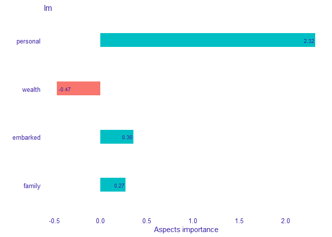
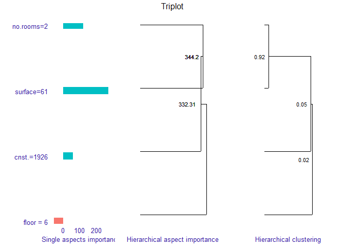

# triplot

<!-- badges: start -->

[](https://cran.r-project.org/package=triplot)
[](https://github.com/ModelOriented/triplot/actions?query=workflow%3AR-CMD-check)
[](https://codecov.io/gh/ModelOriented/triplot?branch=master)
<!-- badges: end -->

## Overview

The `triplot` package provides an instance-level explainer for the
groups of explanatory variables called aspect importance.

Package enables grouping predictors into entities called aspects.
Afterwards, it calculates the contribution of those aspects to the
prediction for a given observation.

Furthermore, package delivers functionality called `triplot`. It
illustrates how the importance of aspects change depending on the size
of aspects.

Key functions:

  - `predict_aspects()` for calculating the feature groups importance
    (called aspects importance) for a selected observation,
  - `predict_triplot()` and `model_triplot()` for summary of automatic
    aspect importance grouping,
  - `group_variables()` for grouping numeric features into aspects.

The `triplot` package is a part of [DrWhy.AI](http://DrWhy.AI) universe.

## Installation

``` r
devtools::install_github("ModelOriented/triplot")
```

## Demo

To illustrate how the function works, we use titanic example. We prepare
model, group features into aspects and choose new observation to be
explained. Then we build `DALEX` explainer and use it to call aspect
importance function. Finally, we print and plot function results. We can
observe that `personal` (`age` and `gender`) variables have the biggest
contribution to the prediction. This contribution is of a positive type.

``` r
library("triplot")
library("DALEX")

titanic <- titanic_imputed
aspects_titanic <-
  list(
    wealth = c("class", "fare"),
    family = c("sibsp", "parch"),
    personal = c("age", "gender"),
    embarked = "embarked"
  )
passenger <- titanic[4,-8]

model_titanic_glm <-
  glm(survived == 1 ~ class + gender + age + sibsp + parch + fare + embarked,
      titanic,
      family = "binomial")

passenger
```

    ##   gender age class    embarked  fare sibsp parch
    ## 4 female  39   3rd Southampton 20.05     1     1

``` r
predict(model_titanic_glm, passenger, type = "response")
```

    ##         4 
    ## 0.4308525

``` r
explain_titanic <- explain(model_titanic_glm, 
                               data = titanic[,-8],
                               y = titanic$survived == "yes", 
                               predict_function = predict,
                               verbose = FALSE)
ai_titanic <- predict_aspects(x = explain_titanic, 
                                   new_observation = passenger, 
                                   variable_groups = aspects_titanic)
ai_titanic
```

    ##   variable_groups importance     features
    ## 4        personal     2.3237  age, gender
    ## 2          wealth    -0.4721  class, fare
    ## 5        embarked     0.3577     embarked
    ## 3          family     0.2710 sibsp, parch

``` r
plot(ai_titanic, add_importance = TRUE)
```



## Triplot

`Triplot` is a tool built on `aspects_importance` function, that allows
us to go one step further in our understanding of the inner workings of
a black box model.

It illustrates, in one place:

  - the importance of every single feature,
  - hierarchical aspects importance (explained below),
  - order of grouping features into aspects in `group_variables()`.

<!-- end list -->

``` r
apartments_num <- apartments[,unlist(lapply(apartments, is.numeric))]

new_observation_apartments <- apartments_num[6,-1]

model_apartments <- lm(m2.price ~ ., data = apartments_num)

explain_apartments <- explain(model = model_apartments, 
                              data = apartments_num[, -1], 
                              verbose = FALSE)

new_observation_apartments
```

    ##   construction.year surface floor no.rooms
    ## 6              1926      61     6        2

``` r
predict(model_apartments, new_observation_apartments)
```

    ##        6 
    ## 3817.634

``` r
tri_apartments <- predict_triplot(explain_apartments,
                                    new_observation = new_observation_apartments)
plot(tri_apartments, abbrev_labels = 10, add_last_group = TRUE)
```



## Acknowledgments

Work on this package was financially supported by the
