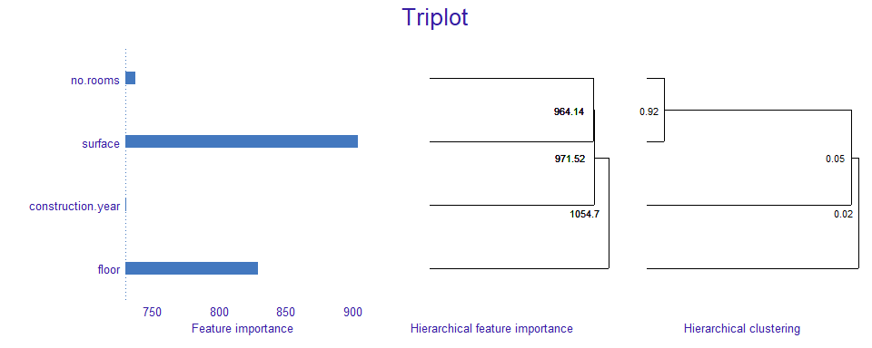
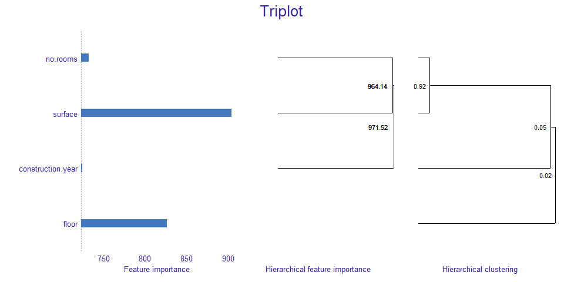
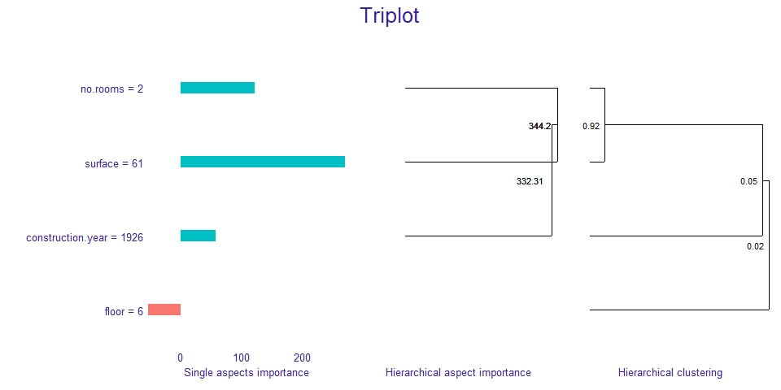

# triplot

<!-- badges: start -->

[](https://cran.r-project.org/package=triplot)
[](https://github.com/ModelOriented/triplot/actions?query=workflow%3AR-CMD-check)
[](https://codecov.io/gh/ModelOriented/triplot?branch=master)
<!-- badges: end -->

## Overview

The `triplot` package provides an instance-level explainer for the
groups of explanatory variables called aspect importance.

Package enables grouping predictors into entities called aspects.
Afterwards, it calculates the contribution of those aspects to the
prediction for a given observation.

Furthermore, package delivers functionality called `triplot`. It
illustrates how the importance of aspects change depending on the size
of aspects.

Key functions:

  - `predict_aspects()` for calculating the feature groups importance
    (called aspects importance) for a selected observation,
  - `predict_triplot()` and `model_triplot()` for summary of automatic
    aspect importance grouping,
  - `group_variables()` for grouping numeric features into aspects.

The `triplot` package is a part of [DrWhy.AI](http://DrWhy.AI) universe.

## Installation

``` r
devtools::install_github("ModelOriented/triplot")
```

## Basic example

For the `titanic` dataset we built logistic regression model that
predicts passanger survival and group features into thematical aspects
(`wealth` contains ticket’ class and fare, `family` information about
family members on board, `personal` includes age and gender and
`embarked` remain as aspect with single feature).

We choose an existing passenger.

``` r
passenger <- titanic[2,]

passenger
```

    ##   gender age class    embarked  fare sibsp parch survived
    ## 2   male  13   3rd Southampton 20.05     0     2        0

``` r
predict(model_titanic_glm, passenger, type = "response")
```

    ##         2 
    ## 0.1531932

It turns out that the model prediction for this passenger’s survival is
very low.

Let’s see which aspects have the biggest influence on it.

We start by building `DALEX` explainer and use it to call
`predict_aspects` function. Afterwards, we print and plot function
results.

We can observe that `wealth` variables have the biggest contribution to
the prediction. This contribution is of a negative type. `Family`
variables have positive influence on the prediction, but it is many
times smaller. Rest of the aspects have very small contribution to the
prediction.

``` r
explain_titanic <- explain(model_titanic_glm, 
                           data = titanic[, -8],
                           y = titanic$survived == "yes",
                           predict_function = predict,
                           label = "Logistic Regression",
                           verbose = FALSE)

ai_titanic <- predict_aspects(x = explain_titanic, 
                              new_observation = passenger[,-8],
                              variable_groups = aspects_titanic)

print(ai_titanic, show_features = TRUE)
```

    ##   variable_groups importance     features
    ## 2          wealth   -0.68985  class, fare
    ## 3          family    0.14762 sibsp, parch
    ## 5        embarked   -0.13525     embarked
    ## 4        personal   -0.06915  age, gender

``` r
plot(ai_titanic, add_importance = TRUE)
```



## Triplot

`Triplot` is a tool that allows us to go one step further in our
understanding of the inner workings of a black box model.

It illustrates, in one place:

  - the importance of every single feature,
  - hierarchical aspects importance,
  - order of grouping features into aspects in `group_variables()`.

We can use it to illustrate the instance level importance of features
(using `predict_aspects` function) or to illustrate the model level
importance of features (using `model_parts` function from `DALEX`
package).

Triplot function can be only used on numerical features. To showcase it,
we will choose only such features from `apartments` dataset, build
explainer, calculate `model_triplot` object and then plot it.

We can observe that, at the model level, surface and floor have the
biggest contribution. Number of rooms and surface are strongly
correlated and together have big influence on the prediction.

``` r
tri_apartments <- model_triplot(explain_apartments)

plot(tri_apartments)
```



Afterwards, we are building triplot for single instance and it’s
prediction.

We can observe that for the given appartment `surface` has also big,
positive influence on prediction. Adding `number of rooms` and then
`construction year` to `surface's` aspect, increases its contribution.

We can see notice that `floor` has the smallest influence on the
prediction, unlike in model wise analysis.

``` r
tri_apartments <- predict_triplot(explain_apartments, 
                                  new_observation = new_observation_apartments)

plot(tri_apartments)
```



## Acknowledgments

Work on this package was financially supported by the
