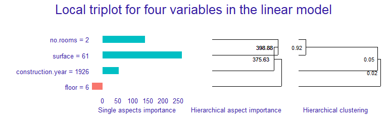
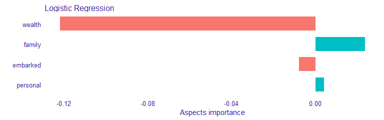

# triplot 

<!-- badges: start -->

[](https://cran.r-project.org/package=triplot)
[](https://github.com/ModelOriented/triplot/actions?query=workflow%3AR-CMD-check)
[](https://codecov.io/gh/ModelOriented/triplot?branch=master)
[](http://drwhy.ai/#eXtraAI)
<!-- badges: end -->

## Introduction

The `triplot` package provides tools for exploration of machine learning
predictive models. It contains an instance-level explainer called
`predict_aspects` (AKA `aspects_importance`), that is able to explain
the contribution of the whole groups of explanatory variables.
Furthermore, package delivers functionality called `triplot` - it
illustrates how the importance of aspects (group of predictors) change
depending on the size of aspects.

Key functions:

  - `predict_aspects()` for calculating the feature groups importance
    (called aspects importance) for a selected observation,
  - `predict_triplot()` and `model_triplot()` for instance- and
    data-level summary of automatic aspect importance grouping,
  - `group_variables()` for grouping of correlated numeric features into
    aspects.

The `triplot` package is a part of [DrWhy.AI](http://DrWhy.AI) universe.
More information about analysis of machine learning models can be found
in the [Explanatory Model Analysis. Explore, Explain and Examine
Predictive Models](https://pbiecek.github.io/ema/) e-book.

## Installation

``` r
devtools::install_github("ModelOriented/triplot")
```

## Overview

`triplot` shows, in one place:

  - the importance of every single feature,
  - hierarchical aspects importance,
  - order of grouping features into aspects.

We can use it to investigate the **instance level** importance of
features (using `predict_aspects()` function) or to illustrate the
**model level** importance of features (using `model_parts()` function
from DALEX package). `triplot` can be only used on numerical features.
More information about this functionality can be found in [triplot
overview](https://modeloriented.github.io/triplot/articles/vignette_aspect_importance.html#hierarchical-aspects-importance-1).

### Basic triplot for a model

To showcase `triplot`, we will choose `apartments` dataset from DALEX,
use it’s numeric features to build a model, create DALEX
[explainer](https://modeloriented.github.io/DALEX/reference/explain.html),
use `model_triplot()` to calculate the `triplot` object and then plot it
with the generic `plot()` function.

#### Import `apartments` and train a linear model

``` r
library("DALEX")
apartments_num <- apartments[,unlist(lapply(apartments, is.numeric))]

model_apartments <- lm(m2.price ~ ., data = apartments_num)
```

#### Create an explainer

``` r
explain_apartments <- DALEX::explain(model = model_apartments, 
                              data = apartments_num[, -1],
                              y = apartments_num$m2.price,
                              verbose = FALSE)
```

#### Create a triplot object

``` r
set.seed(123)
library("triplot")

tri_apartments <- model_triplot(explain_apartments)

plot(tri_apartments) + 
  patchwork::plot_annotation(title = "Global triplot for four variables in the linear model")
```

<div class="figure" style="text-align: center">


<p class="caption">

The left panel shows the global importance of individual variables.
Right panel shows global correlation structure visualized by
hierarchical clustering The middle panel shows the importance of groups
of variables determined by the hierarchical clustering.

</p>

</div>

At the model level, `surface` and `floor` have the biggest
contributions. But we also know that `Number of rooms` and `surface` are
strongly correlated and together have strong influence on the model
prediction.`Construction year` has small influence on the prediction, is
not correlated with `number of rooms` nor `surface` variables. Adding
`construction year` to them, only slightly increases the importance of
this group.

### Basic triplot for an observation

Afterwards, we are building triplot for single instance and it’s
prediction.

``` r
(new_apartment <- apartments_num[6, -1])
```

    ##   construction.year surface floor no.rooms
    ## 6              1926      61     6        2

``` r
tri_apartments <- predict_triplot(explain_apartments, 
                                  new_observation = new_apartment)

plot(tri_apartments) + 
  patchwork::plot_annotation(title = "Local triplot for four variables in the linear model")
```

<div class="figure" style="text-align: center">



<p class="caption">

The left panel shows the local importance of individual variables
(similar to LIME). Right panel shows global correlation structure
visualized by hierarchical clustering The middle panel shows the local
importance of groups of variables (similar to LIME) determined by the
hierarchical clustering.

</p>

</div>

We can observe that for the given apartment `surface` has also
significant, positive influence on the prediction. Adding `number of
rooms`, increases its contribution. However, adding `construction year`
to those two features, decreases the group importance.

We can notice that `floor` has the small influence on the prediction of
this observation, unlike in the model-level analysis.

## Basic aspect importance

For this example we use `titanic` dataset with a logistic regression
model that predicts passenger survival. Features are combined into
thematic aspects.

### Importing dataset and building a logistic regression model

``` r
set.seed(123)

model_titanic_glm <- glm(survived ~ ., titanic_imputed, family = "binomial")
```

### Manual selection of aspects

``` r
aspects_titanic <-
  list(
    wealth = c("class", "fare"),
    family = c("sibsp", "parch"),
    personal = c("age", "gender"),
    embarked = "embarked"
  )
```

### Select an instance

We are interested in explaining the model prediction for the `johny_d`
example.

``` r
(johny_d <- titanic_imputed[2,])
```

    ##   gender age class    embarked  fare sibsp parch survived
    ## 2   male  13   3rd Southampton 20.05     0     2        0

``` r
predict(model_titanic_glm, johny_d, type = "response")
```

    ##         2 
    ## 0.1531932

It turns out that the model prediction for this passenger’s survival is
very low. Let’s see which aspects have the biggest influence on it.

We start with DALEX
[explainer](https://modeloriented.github.io/DALEX/reference/explain.html).

``` r
explain_titanic <- DALEX::explain(model_titanic_glm, 
                           data = titanic_imputed,
                           y = titanic_imputed$survived,
                           label = "Logistic Regression",
                           verbose = FALSE)
```

And use it to call `triplot::predict_aspects()` function. Afterwards, we
print and plot function results

``` r
library("triplot")

ai_titanic <- predict_aspects(x = explain_titanic, 
                              new_observation = johny_d[,-8],
                              variable_groups = aspects_titanic)

print(ai_titanic, show_features = TRUE)
```

    ##   variable_groups importance     features
    ## 2          wealth  -0.122049  class, fare
    ## 3          family   0.023564 sibsp, parch
    ## 5        embarked  -0.007929     embarked
    ## 4        personal   0.004069  age, gender

``` r
plot(ai_titanic)
```



We can observe that `wealth` (class, fare) variables have the biggest
contribution to the prediction. This contribution is of a negative type.
`Personal` (age, gender) and `Family` (sibsp, parch) variables have
positive influence on the prediction, but it is much smaller. `Embarked`
feature has very small, negative contribution to the prediction.

## Acknowledgments

Work on this package was financially supported by the NCBR Grant
POIR.01.01.01-00-0328/17.
